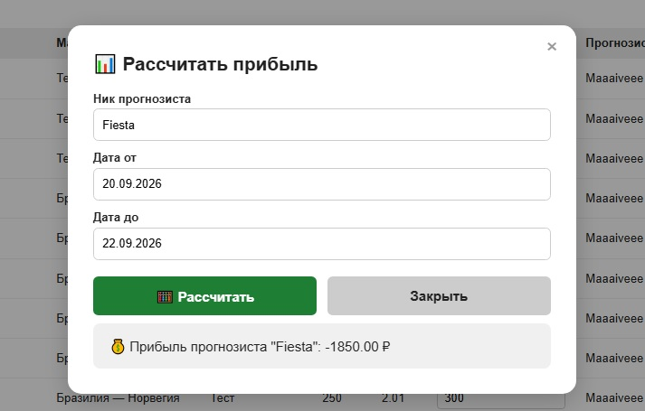
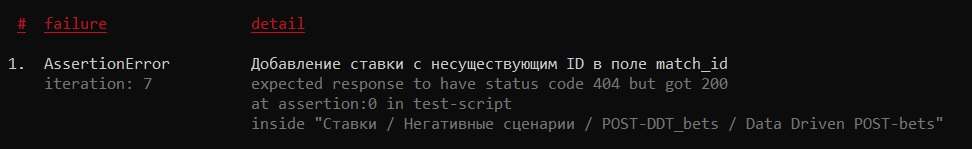
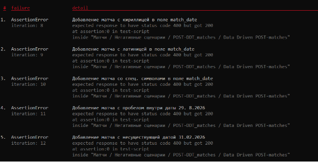
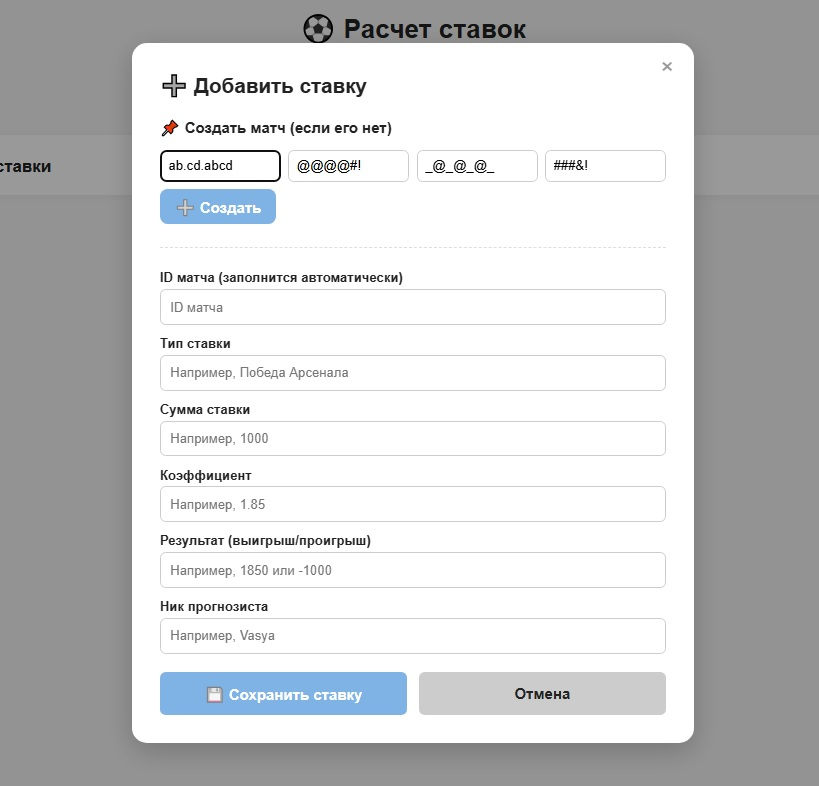
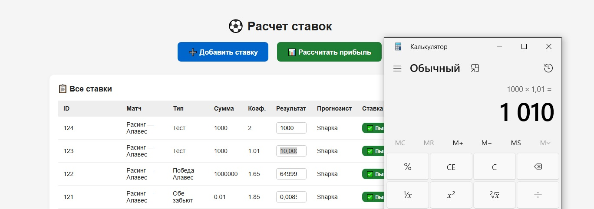
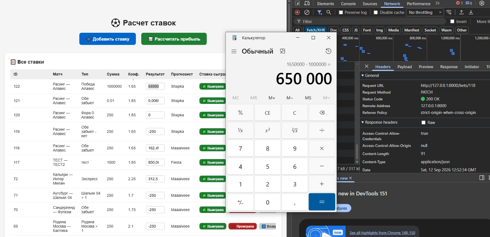
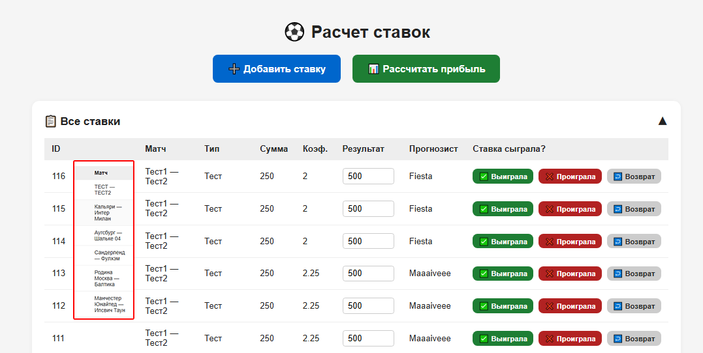

# 7 баг-репортов + улучшения, предложенные на этапе тестирования
> Все баг-репорты перенесены из YouTrack (из-за ограничений бесплатного пользования)

## Рассчитать прибыль : Игнорируется возможность рассчитать результат прогнозиста по периоду "От" и "До". Результат считается за всё время сразу. (BUG-ID 1)

**Severity:** Major · **Priority:** High · **Статус:** Fixed  
**Окружение:** Windows 10 22H2, Chrome 149.0.7827103 (64-bit) · **Версия:** 1.02

### Предусловия
1. Для расчёта по периоду заранее созданы 2 ставки, с общим выигрышем 700 рублей. Одна на матч 20.09.2026, другая на матч 22.09.2026.

2. У пользователя уже открыто модальное окно "Рассчитать прибыль"

### Шаги для воспроизведения
1. В поле "Ник прогнозиста" ввести ник существующего прогнозиста ("Maaaiveee")

2. В поля "Дата от" и "Дата до" ввести даты : "20.09.2026" и "22.09.2026"

3. Нажать на кнопку "Рассчитать"

### Ожидаемый результат
Получен результат прогнозиста с 20.09.2026 по 22.09.2026 (700 рублей).

### Фактический результат
Результат (прибыль) прогнозиста рассчитывается за всё время сделанных им ставок.

### о Severity и Priority
Практически основная функция приложения. Исправлять нужно в первую очередь.

## POST/bets : API позволяет создать ставку с несуществующим match_id. (например, match_id = 1000, но такой матч еще не существует) (BUG-ID 2)

**Severity:** Major · **Priority:** High · **Статус:** Fixed  
**Окружение:** Windows 10 22H2, Chrome 149.0.7827103 (64-bit) · **Версия:** 1.01

### Шаги для воспроизведения
1. Отправить POST запрос на /bets с телом, содержащим "match_id : 1000"

{

"match_id": 1000,

"bet_type": "Обе забьют",

"bet_amount": 250,

"coefficient": 2.25,

"win_or_loss": 300,

"bettor_id": 3

}

2. Проверить ответ сервера.

### Ожидаемый результат
Получен код 404 Not Found и сообщение о том, что такого матча не существует.

### Фактический результат
Получен код 200 ОК, ставка успешно создаётся с ID несуществующего матча.

### о Severity и Priority
Нарушает целостность данных, можем накопить "мусорные" записи. Можем получить путаницу в БД и нарушение её логики.

## POST/matches : API принимает невалидные значения в поле match_date (кириллица, латиница, спецсимволы, несуществующая дата и пробелы) (BUG-ID 3)

**Severity:** Major · **Priority:** Medium · **Статус:** Fixed  
**Окружение:** Windows 10 22H2, Chrome 149.0.7827103 (64-bit) · **Версия:** 1.01

### Шаги для воспроизведения
1. Отправить POST-запрос на /matches со следующими значениями в поле match_date (поочерёдно, все остальные поля заполнены валидными данными):

(Кириллица: "аб.вр.дев"

Латиница: "ab.cd.efgh"

Спецсимволы: "@#.#@.@!@#"

Пробел внутри: "29. 8.26"

Несуществующая дата: "31.02.2026")

2. Проверить ответ сервера для каждого случая.

### Ожидаемый результат
Во всех случаях получен статус 400 Bad Request и сообщение о том, что формат даты должен соответствовать шаблону ДД.ММ.ГГГГ (только цифры и точки).

### Фактический результат
Во всех случаях получен статус 200 OK, матч успешно создается с невалидной датой.

## Фронтенд : Нет валидации и подсказок в форме создания матча (BUG-ID 4)

**Severity:** Minor · **Priority:** Medium · **Статус:** Open (в бэклоге)
**Окружение:** Windows 10 22H2, Chrome 149.0.7827.103 (64-bit)
**Версия приложения:** 1.01

### Предусловие
Открыто модальное окно создания матча (через «Добавить ставку»)

### Шаги воспроизведения
1. Ввести невалидные значения во все 4 поля формы:
   - Дата: `ab.cd.abcd`
   - Турнир: `@@#@#@!#`
   - Команда 1: `@@@`
   - Команда 2: `####&!`
2. Проверить реакцию UI

### Ожидаемый результат
1. При вводе невалидного значения — показывается сообщение/подсказка о требуемом формате
2. В поле «Дата» ввод букв и спецсимволов **блокируется** на уровне UI

### Фактический результат
1. Никаких сообщений или подсказок о невалидных значениях — форма не реагирует
2. В поле «Дата» ввод букв и спецсимволов не блокируется

### Дополнительно
В placeholder поля «Дата» не хватает 4-й "Г" в году (ДД.ММ.ГГГ)

### о Severity и Priority
Не блокирует создание матча с валидными данными, но ухудшает UX: 
пользователь не понимает, что и где он ввёл неверно. Требует исправления 
для релиза.

## Фронтенд : При расчёте выигрыша ставки с коэффициентом 1.01 результат содержит артефакт плавающей точки (10.000000000000009) (BUG-ID 5)

**Severity:** Minor · **Priority:** Low · **Статус:** Fixed
**Окружение:** Windows 10 22H2, Chrome 149.0.7827103 (64-bit)
**Версия приложения:** 1.03

### Предусловие
Пользователь заранее создал ставку: сумма 1000 ₽, коэффициент 1.01. Ставка выиграла.

### Шаги воспроизведения
1. Нажать кнопку «Выиграла» рядом со ставкой на 1000 ₽ с коэффициентом 1.01.

### Ожидаемый результат
Получена чистая прибыль **10 рублей**  
(1000 × 1.01 = 1010; 1010 − 1000 = 10)

### Фактический результат
Получена чистая прибыль **10.000000000000009** при выигрыше этой ставки.

### Обоснование Severity/Priority
Не блокирует функционал, но может сбить пользователя с толку, + выдавать не самый точный расчёт.

### Скрин

## Фронтенд : При расчёте выигрыша ставки на сумму 1000000, на коэффициент 1.65 результат содержит артефакт плавающей точки (649999,9999999999) (BUG-ID 6)

**Severity:** Minor · **Priority:** Low · **Статус:** Fixed
**Окружение:** Windows 10 22H2, Chrome 149.0.7827.103 (64-bit)
**Версия приложения:** 1.03

### Предусловие
Пользователь заранее создал ставку: сумма 1 000 000 ₽, коэффициент 1.65. Ставка выиграла.

### Шаги воспроизведения
1. Нажать кнопку «Выиграла» рядом со ставкой.

### Ожидаемый результат
Чистая прибыль рассчитана как **650 000 ₽**  
(1 000 000 × (1.65 − 1) = 650 000)

### Фактический результат
Чистая прибыль рассчитана как **649999.9999999999** — артефакт плавающей точки.

### Обоснование Severity/Priority
Не блокирует функционал, но может сбить пользователя с толку и дать неточный расчёт. 

### Скрин

## Фронтенд : Кнопка «Проиграла» сливается с эмодзи ❌ и съехало наименование команд (BUG-ID 7)

**Severity:** Trivial (Cosmetic) · **Priority:** Low · **Статус:** Fixed
**Окружение:** Windows 10 22H2, Chrome 149.0.7827.103 (64-bit)
**Версия приложения:** 1.03

### Предусловие
Открыт выпадающий список «Все ставки».

### Шаги воспроизведения
1. Обратить внимание на кнопки «Выиграла / Проиграла / Возврат» в строке ставки.
2. Обратить внимание на отображение наименования команд.

### Ожидаемый результат
1. Кнопка «Проиграла» имеет нейтральный красный цвет, не сливается с эмодзи ❌ и не бросается в глаза.
2. Наименование команд отображается как: `Команда 1 — Команда 2`.

### Фактический результат
1. Кнопка «Проиграла» имеет яркий красный цвет и сливается с эмодзи ❌, "режет глаз".
2. Наименование съехало: `Команда 2` пишется **под** `Команда 1`.

### Улучшение (предложение)
Эмодзи ❌ можно убрать — они не несут смысловой нагрузки и в основном сливаются с цветом самой кнопки.

### Обоснование Severity/Priority
Косметический дефект. Не влияет на функционал, но ухудшает визуальное восприятие 
и читаемость списка ставок. Исправлено приведением кнопок к единому виду.

### Скрин

---

## Улучшения, добавленные мной уже на этапе тестирования :

Во время тестирования понял, что рассчитывать ставки неудобно, слишком много "ручного" ввода. Так же попросил изменить вид приложения к единому, убрать разноцветные кнопки и эмодзи.

- **Кнопки «Выиграла / Проиграла / Возврат»** — изначально их не было, 
  результат нужно было переписывать вручную, что очень неудобно. 
  Попросил реализовать это через `PATCH`-метод с авторасчётом прибыли и добавить кнопки.

- **Приведение вида приложения к единому** — Попросил убрать лишние эмодзи и сделать кнопки одинакового цвета, чтобы ничего не выбивалось и не резало глаз.

- **Убрали обязательность `match_result`** на раннем этапе — не так важен 
  результат матча, всё-таки это приложение про ставки и профит с них.

